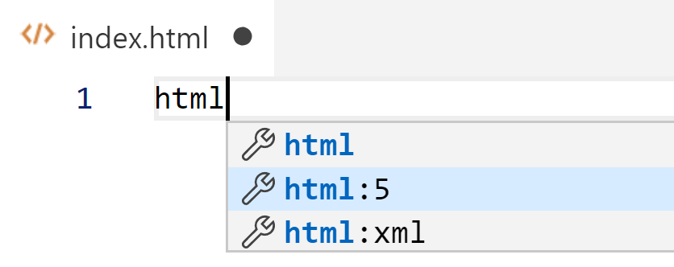

# Chapter 1: Practice with Basics of HTML, CSS, and JS
## Objectives
* Create an HTML document with minimal styling and dynamic behavior


## Overview:
You will create an html document using VSCode HTML Snippets, and add basic styling and basic JavaScript.

Follow the steps, and if you need additional help you can refer to the slides, demos, or the `solution` folder.

## Steps:

### Create a basic page with VSCode

1. In your MyWebCourse project, create a new file called `index.html`. 

2. In the empty `index.html` file, type `html` and pause. You should see a menu with options for html templates. Choose the one with html:5
   
   

    We will review the structure of this file in upcoming chapters.

3. In `<head>` look for `<title>` modify it's content so that it looks like this:
    ```html
    <title>Basics of HTML, CSS and JavaScript</title>
    ```

    ### Add some JavaScript

4. After `<title>`, and before the closing `</head>` tag, add opening and closing `<script></script>` tags.

5. Type in the following code, notice as you type, the editor offers autocompletion. Replace XXXX with your first name.

    ```html
        <script>
            function init() {
                document.getElementById("name").innerHTML = 'XXXX';
            }
        </script>
    ```            

6. Modify the `<body>` start tag as shown to include the onload attribute as shown. This will trigger the function called init(), after the rest of the page has been loaded.
    ```html
    <body onload="init()">
    ```

7. In `<body>`, add this line of code, 
    ```html
    <div id="name"></div>
    ```
    Notice the div element has an attribute of id, with a value of name. this is what the JavaScript will target.

8. Save and then open the file in the Chrome browser and check that your name is displayed. You can right-click the html file and choose open in browser, or use the shortcut ALT-B (i you have installed the Open In Browser extension). The first time you use `Open in Browser` you will be prompted for which browser to set as the default.

9.  Is the page displaying your name as expected? 

    If not, are there any errors? You can find out by opening the browser dev tools. Right click in the browser and choose Inspect. The brings up the dev tools and may point to possible errors including which line number to focus in on. 

    Make any necessary fixes - make sure your name is displayed before you move on. Ask fellow students or your instructor for help if needed. (answering questions is a great way to learn!)

10. If you did not get a chance to see and correct an error, add one now. Change your function to be named `init2`. Reload the page, and open the browser dev tools (see details in the last step) to see the error message.  Fix the problem and make sure your site is working, then move to the next step.

    ### Add some style with CSS

11. In the `<head>`, add opening and closing `<style>` tags. You can copy the following code, or if typing - see how VSCode recommends autocompletion.

    ```html
    <style>
        div {
            width: 300px;
            padding: 10px;
            border: 1px solid purple;
            background-color: grey;
            color: purple
        }

    </style>
    ```

12. Go back to the browser and reload to see your changes. Your name should now be in a grey box with a purple border.

13. Mark your work as complete.

14. If you are done before others, continue to the Bonus.

## Bonus

1. Add another div with an id of hobbies. Use the init() function to target this div and update it with your hobbies. 

1. If you already have existing experience with web create an unordered list for the hobbies. Try using an array and looping to populate the screen.
   
2. Open the Interactive Playground from the VSCode Help menu and explore what is possible.
