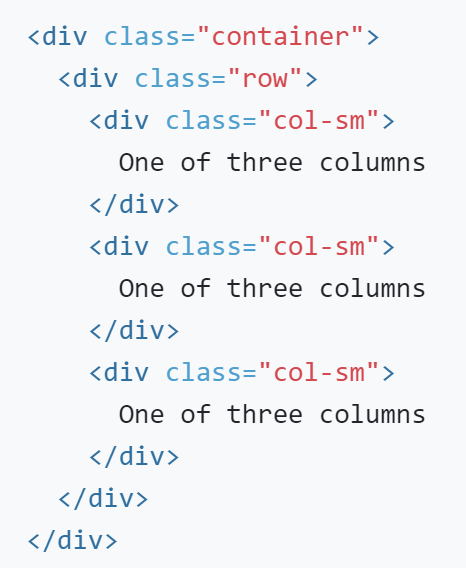

# Chapter 5: Responsive Styling with Bootstrap

## Objectives
* Use Grid System to lay out the content that fluidly resizes on all the
* devices.  
* Lay out the 3 rows to display 3 equal width columns on large display.
* Make the layout 2 columns on a med width display.
* The content stacks to a single column layout on small display.

## Steps

1. Create a **bootstrap** directory in your working project.

2. Look in the same directory as this README.md and copy the file named `starterTemplate.html` into the new **bootstrap** directory. Right-click to rename the file **grid.html**. This file already has Bootstrap included from a CDN.

3. Open your new **grid.html** in the browser to see how it currently displays 3 breeds of dogs.

4. To get started, modify the **grid.html** file to use Bootstrap classes. The outermost div should have **container**, followed by **row**. 

    

    For each of the 3 divs that immediately surround a dog, repeat the line with red dots. For the red dots, put the correct values to indicate that xs screens should take up 12 columns, small should take up 6, and medium and larger should take up 4.
    

5. Now, reload this file in the browser and change the size of the browser window. It should be responsive to screen size changes.

6. Mark your work as complete.

## Bonus

1. If done before others, experiment with spacing using Bootstrap margin and padding shortcuts. https://getbootstrap.com/docs/4.2/utilities/spacing/ 

2. Use Bootstrap in Practice Bonus Problems - About Me project.